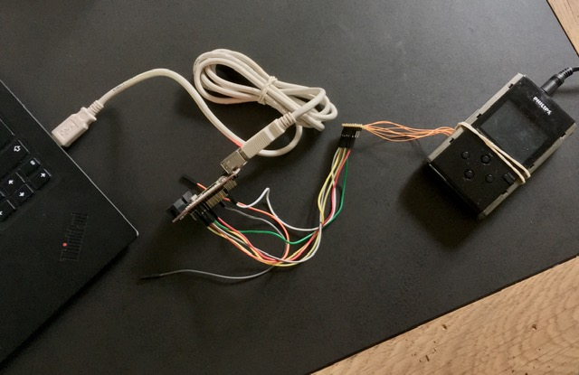
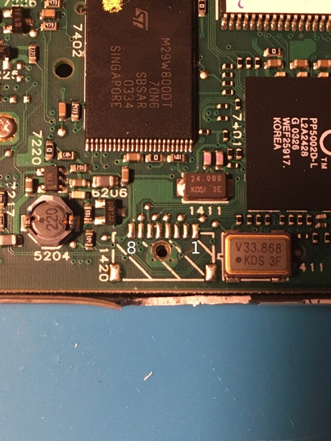

# PortalPlayer PP5002 JTAG



## JTAG pinout of a Philips HDD100



| Pin no            | 8   | 7     | 6     | 5     | 4     | 3     | 2     | 1     |
|-------------------|-----|-------|-------|-------|-------|-------|-------|-------|
| Assignment        | GND | TCK   | TDO   | TDI   | TMS   | TRST  | RTCK  | 3V3   |
| Measured voltage  | 0V  | 3.32V | 0.02V | 3.33V | 3.33V | 3.33V | 3.33V | 3.33V |
| Resistance to 3V3 | OL  | 9.8k  | OL    | 9.9k  | 9.9k  | 9.9k  | 62R   | 0R    |
| Resistance to GND | 0R  | OL    | 8.8M  | OL    | OL    | OL    | OL    | OL    |

## UrJTAG identification

```
IR length: 8
Chain length: 2
Device Id: 00101111000111110000111100001111 (0x2F1F0F0F)
  Unknown manufacturer! (11110000111) (/usr/share/urjtag/MANUFACTURERS)
Device Id: 00101111000111110000111100001111 (0x2F1F0F0F)
  Unknown manufacturer! (11110000111) (/usr/share/urjtag/MANUFACTURERS)
```

## OpenOCD identification

Using [a custom OpenOCD script](openocd.tcl):

```
Open On-Chip Debugger 0.11.0+dev-00883-gec03ac6b5 (2022-11-05-14:09)
Licensed under GNU GPL v2
For bug reports, read
	http://openocd.org/doc/doxygen/bugs.html
Info : only one transport option; autoselect 'jtag'
Warn : Transport "jtag" was already selected
pp5002.cop
Info : Listening on port 6666 for tcl connections
Info : Listening on port 4444 for telnet connections
Info : clock speed 1000 kHz
Info : JTAG tap: pp5002.cpu tap/device found: 0x2f1f0f0f (mfg: 0x787 (<unknown>), part: 0xf1f0, ver: 0x2)
Info : JTAG tap: pp5002.cop tap/device found: 0x2f1f0f0f (mfg: 0x787 (<unknown>), part: 0xf1f0, ver: 0x2)
Info : Embedded ICE version 1
Info : pp5002.cpu: hardware has 2 breakpoint/watchpoint units
Info : Embedded ICE version 1
Info : pp5002.cop: hardware has 2 breakpoint/watchpoint units
Info : starting gdb server for pp5002.cpu on 3333
Info : Listening on port 3333 for gdb connections
Info : starting gdb server for pp5002.cop on 3334
Info : Listening on port 3334 for gdb connections
```
