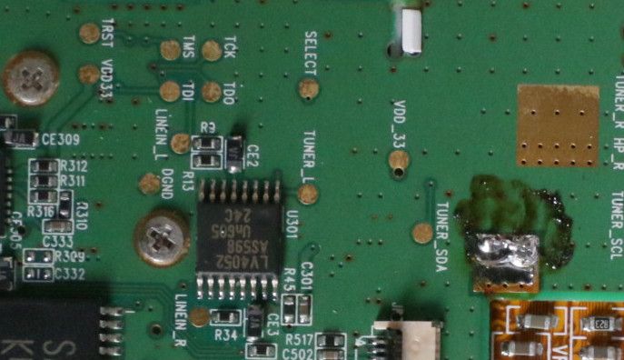

# PortalPlayer PP5020 JTAG

Documenting things I discovered while messing around with JTAG on a PP5020 PMP.

## JTAG pinout of an iRiver H10

Everything is on the silkscreen :-)



## Issues halting

For some reason I wasn't able to halt the ARM core, preventing any meaningful usage of the JTAG TAP. In order to fix this issue, I had to plug a hard drive to my iRivier H10. The PMP I bought had a broken hard drive flex cable, which I unsoldered and replaced with the flex cable from an iPod 4G.

## UrJTAG identification

```
IR length: 8
Chain length: 2
Device Id: 00111111000011110000111100001111 (0x3F0F0F0F)
  Unknown manufacturer! (11110000111) (/usr/share/urjtag/MANUFACTURERS)
Device Id: 00111111000011110000111100001111 (0x3F0F0F0F)
  Unknown manufacturer! (11110000111) (/usr/share/urjtag/MANUFACTURERS)
```

## OpenOCD identification

```
Open On-Chip Debugger 0.11.0+dev-00883-gec03ac6b5 (2022-11-05-14:09)
Licensed under GNU GPL v2
For bug reports, read
  http://openocd.org/doc/doxygen/bugs.html
Info : only one transport option; autoselect 'jtag'
Warn : Transport "jtag" was already selected
pp5020.cpu
Info : Listening on port 6666 for tcl connections
Info : Listening on port 4444 for telnet connections
Info : clock speed 1000 kHz
Info : JTAG tap: pp5020.cpu tap/device found: 0x3f0f0f0f (mfg: 0x787 (<unknown>), part: 0xf0f0, ver: 0x3)
Info : JTAG tap: pp5020.cop tap/device found: 0x3f0f0f0f (mfg: 0x787 (<unknown>), part: 0xf0f0, ver: 0x3)
Info : Embedded ICE version 1
Info : pp5020.cop: hardware has 2 breakpoint/watchpoint units
Info : Embedded ICE version 1
Info : pp5020.cpu: hardware has 2 breakpoint/watchpoint units
Info : starting gdb server for pp5020.cop on 3333
Info : Listening on port 3333 for gdb connections
Info : starting gdb server for pp5020.cpu on 3334
Info : Listening on port 3334 for gdb connections
```
